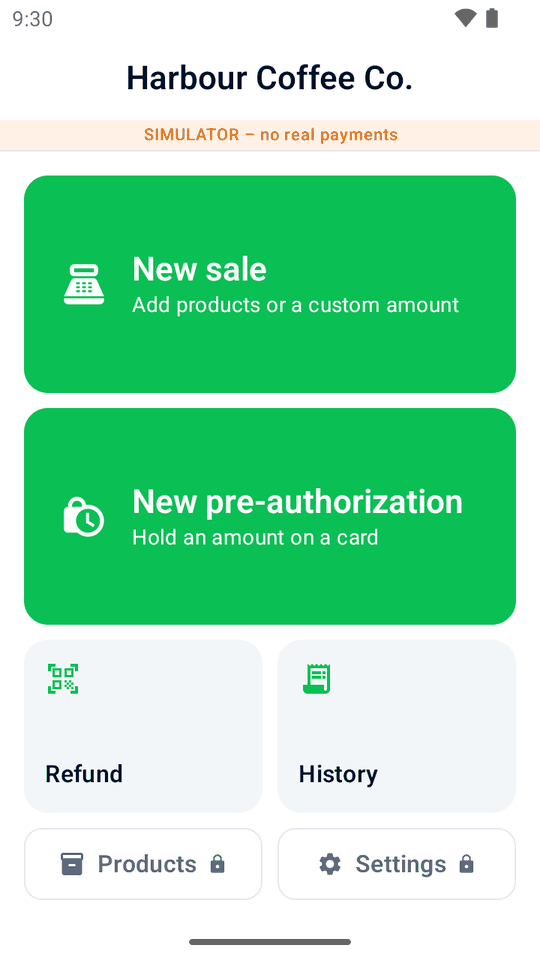
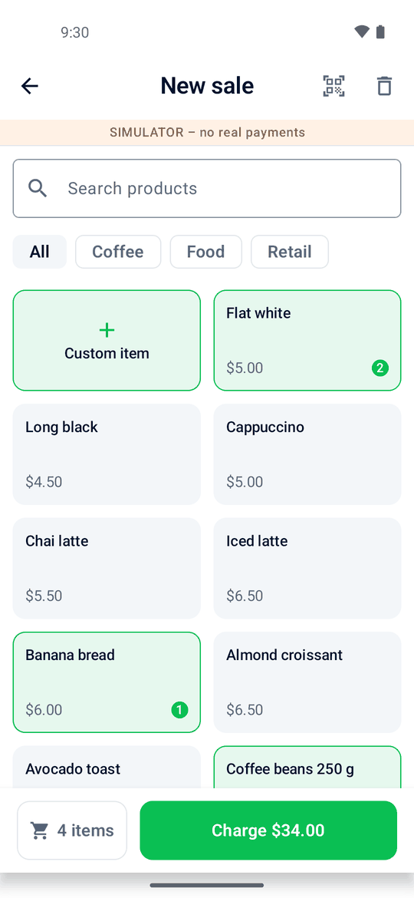
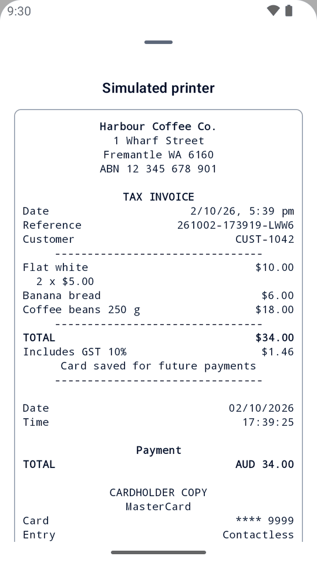

# Mini mPOS

A free, open-source point-of-sale app that runs **directly on Adyen Android payment terminals**. Add products,
take a payment, deliver a receipt and refund the payment on one terminal. No separate till or app subscription is needed.

The same app works on Android tablets and phones with an Adyen terminal on your network or over the internet,
or with Tap to Pay through the Adyen Payments app.

[Website](https://minimpos.app/) ·
[Download APK](https://github.com/astiskala/minimpos/releases/latest) ·
[简体中文](https://minimpos.app/zh-CN/) ·
[日本語](https://minimpos.app/ja/)

  
  
  

Screenshots show an English demo café using the built-in simulator, not live payments.

> [!IMPORTANT]
> Mini mPOS is an independent project, not made, endorsed or supported by Adyen. Test your setup in the Adyen test
> environment before you take live payments.

## What you can do

- **Sell:** products, categories, barcode scanning and custom amounts, with your own tax rates and any Adyen currency.
- **Get paid:** card and wallet payments, merchant-scanned wallet codes, payment links, pre-authorizations for deposits,
  and tips written on receipts.
- **Deliver receipts:** print on a terminal with a printer, email through your SMTP server, or share from a tablet or phone.
- **Manage payments:** referenced refunds in full, by item or by amount; searchable history and daily totals.
- **Run your setup:** admin and Manager PINs, optional shopper references and card saving, and QR transfers of products,
  settings and encrypted keys to additional devices.

The app supports English, Simplified Chinese and Japanese. Products, settings and history stay on each device;
there is no backend, tracking or automatic synchronization between devices.

## Try it or set it up

**Just exploring?** Install `minimpos-<version>.apk` from the
[latest release](https://github.com/astiskala/minimpos/releases/latest) on an Android phone (Android 9+) or emulator.
Away from an Adyen terminal, the default is the simulator: no account, keys or real card needed. Choose outcomes and
printer behavior in Settings › Simulator. Offline demo links let you try the payment-link workflow too.

**Ready to connect to Adyen?** Follow [Quick start](https://minimpos.app/quick-start.html).
It covers device, network and credential prerequisites, deployment and all four payment setups. Every real-payment
setup needs the Checkout API; the [setup helper](https://minimpos.app/setup.html) lets you enter keys
on a computer and scan them in.

| Guide | What it covers |
| --- | --- |
| [Quick start](https://minimpos.app/quick-start.html) | Check prerequisites, install, connect, test and go live. |
| [Using Mini mPOS](https://minimpos.app/using.html) | Daily operations: sell, refund, receipts, closing the day, deposits, tips and more devices. |
| [Troubleshooting](https://minimpos.app/troubleshooting.html) | Unknown results, declines, pairing, network, capture, printer and email problems. |

## Important boundaries

Mini mPOS has no server to receive Adyen webhooks. Refunds and captures shown as **requested** need final confirmation
in the Customer Area. Paid payment links are refunded there, not in the app. If a payment's result is unknown, check it
before charging again.

Mini mPOS saves API keys encrypted on the device. This is a trade-off against the Adyen recommendation to keep
keys on a server. Use narrowly scoped credentials, protect the device, and review [SECURITY.md](SECURITY.md).

## For contributors

See [CONTRIBUTING.md](CONTRIBUTING.md) for building, testing, architecture and releases—including signing your own APK.
Use [CONTEXT.md](CONTEXT.md) for domain terminology. Report vulnerabilities privately through
[the security policy](SECURITY.md), not a public issue.

## License

[MIT](LICENSE) © 2026 Adam Stiskala. Adyen is a trademark of Adyen N.V.
