# Mini mPOS

A free, open-source point-of-sale app that runs directly on Adyen Android payment terminals. Sell products, take card
and wallet payments or send a payment link, print, email or share receipts, and refund by scanning a receipt. Hold
deposits and collect tips too, all on the terminal itself, with no extra tablet or app subscription. The same app runs
on Android tablets and phones, taking payments on a terminal over your network or the internet, or with Tap to Pay
through the Adyen Payments app.

[](https://github.com/astiskala/minimpos/actions/workflows/ci.yml)
[](LICENSE)


**Website:** <https://astiskala.github.io/minimpos/> · **Setup guide:**
<https://astiskala.github.io/minimpos/getting-started.html> · **Setup helper:**
<https://astiskala.github.io/minimpos/setup.html>

**简体中文:** [网站](https://astiskala.github.io/minimpos/zh-CN/) ·
[快速入门](https://astiskala.github.io/minimpos/zh-CN/getting-started.html) ·
**日本語:** [ウェブサイト](https://astiskala.github.io/minimpos/ja/) ·
[はじめに](https://astiskala.github.io/minimpos/ja/getting-started.html)

<p align="center">
  
  
  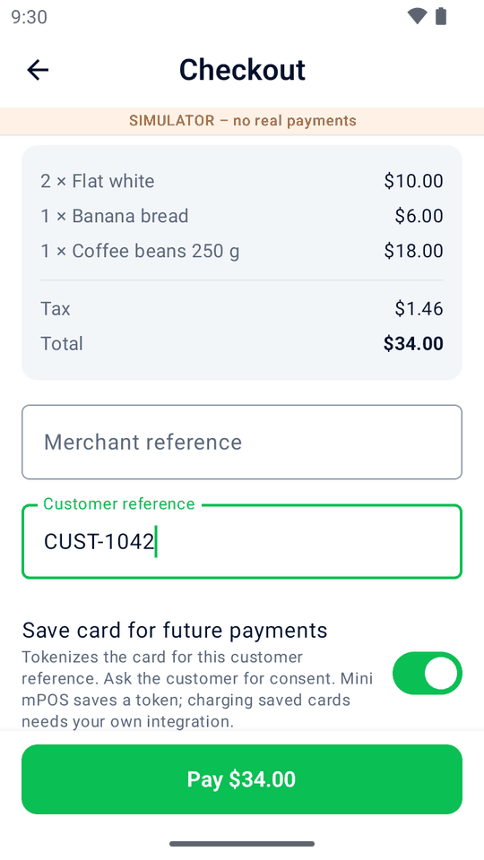
  
</p>

> [!IMPORTANT]
> Mini mPOS is an independent project. It is not an official Adyen product and is not supported by Adyen. Test it
> thoroughly in your Adyen TEST environment before taking live payments.

## Features

### Selling

- **Products and categories** in a local database, each with a name, price, tax rate and optional barcode.
- **Sales** from a product grid with search, category filters and barcode scanning, plus keyed-in custom amounts.
- **Flexible tax**: your own named rates, prices with tax included or tax added at checkout, or tax switched off. A new
  installation starts with the standard rate of the device's country where the app knows it, and a 0% rate.
- **Any Adyen currency**: all 138 currencies Adyen processes, with Adyen's own decimals, whatever country you are in.

### Getting paid

- **Card and wallet payments** through Adyen, on the terminal the app runs on.
- **Payment links** (Adyen [Pay by Link](https://docs.adyen.com/unified-commerce/pay-by-link)) instead of the terminal:
  the customer scans the link's QR code, or you email, print or share it, and they pay on Adyen's payment page.
- **Pre-authorizations** for deposits, bookings and hire: hold an amount on the card, then capture it (more or less than
  held), adjust what it holds, or cancel it.
- **Tipping on the receipt** for table service: the receipt prints with blank Tip and Total lines, and the app captures
  the bill plus the tip the customer wrote, following Adyen's
  [tipping on the receipt](https://docs.adyen.com/point-of-sale/tipping/tipping-on-receipt) flow.
- **Shopper references and saved cards**: optionally send a shopper reference with every payment (a customer reference
  typed at checkout, or the shopper's email, hashed by default) and offer to save the card under it, with the shopper's
  consent. Both are off on a new installation.

### After the sale

- **Receipts** printed as one slip on terminals with a printer: your header, the items, tax, the card receipt and a
  refund QR code. They can also be **emailed** through your own mail server (the app fills in the server for common
  providers) and, on tablets and phones, **shared** as an image through Android's share sheet.
- **Referenced refunds**: scan the receipt's QR code, or start from history. Refund in full, by item, or an amount.
- **History** by day with daily totals, filters (sales, awaiting tip, pre-auths, refunds, needs attention), a payment
  method menu, and a **search** by reference, auth code, shopper, card, brand, wallet or amount.
- **Captures through the Checkout API**: with your merchant account and an API key, the app captures tips and
  pre-authorizations, adjusts what they hold and sends payment links itself.

### Setting up and running it

- **Guided setup** in numbered steps: on a terminal only the shared key and the Checkout API are needed. The terminal
  ID, address and TEST/LIVE environment are detected, and Home says what is still missing until payments can go
  through. A new installation is ready to sell: checkout asks for nothing but payment, and receipts print by themselves.
- **Setup helper**: a [web page](https://astiskala.github.io/minimpos/setup.html) where you paste the keys and account
  codes on a computer, next to the Customer Area, and scan them into the device as QR codes instead of typing long API
  keys on a keypad. It runs entirely in the browser and seals the keys with a transfer code.
- **Set up more devices from one**: share the catalog, settings and (with a one-time transfer code) passwords and keys
  with another device as QR codes. No cloud account or computer needed.
- **Admin PIN** for settings and products, with automatic re-lock.
- **Made for terminal screens**, down to the AMS1's 4-inch display: layouts tighten on small screens and the main
  action (Pay, Refund, Save, New sale) stays in reach without scrolling.
- **Tablets and phones too**: payments go to a terminal on your network, a terminal over the internet (Adyen's Cloud
  device API), or **Tap to Pay** on the phone itself through the Adyen Payments app. See
  [Use it on a tablet or phone](#use-it-on-a-tablet-or-phone).
- **Built-in simulator**, so you can try every flow on a phone or emulator without a terminal.
- **English, Simplified Chinese and Japanese**, with receipts laid out for wide characters (see
  [Language and receipts](#language-and-receipts)).

## Screenshots

| Selling | Paying | Receipts and refunds | Managing |
| :---: | :---: | :---: | :---: |
|  |  |  | 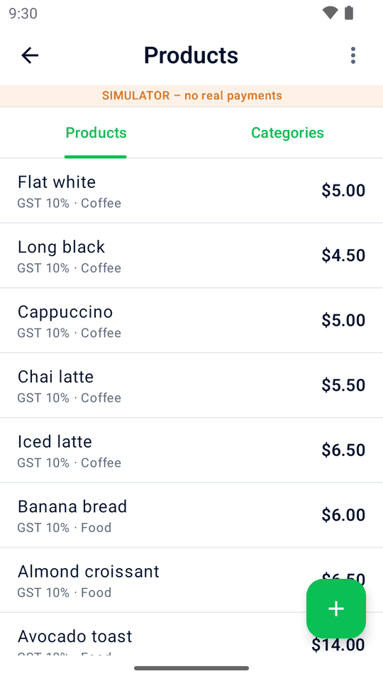 |
| Home | Checkout | Printed receipt | Products |
|  | 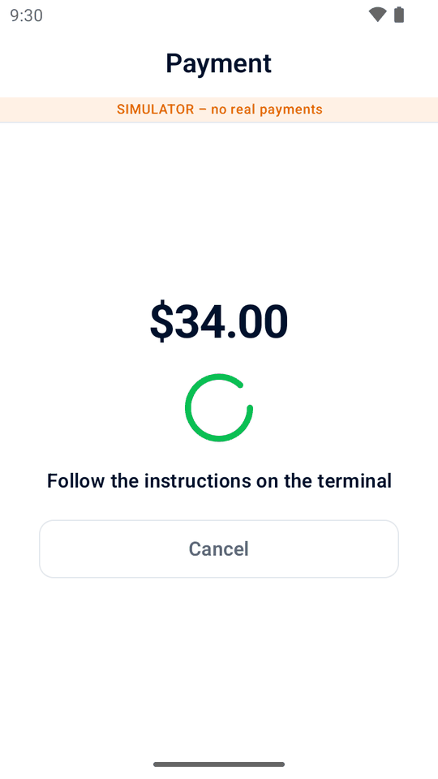 | 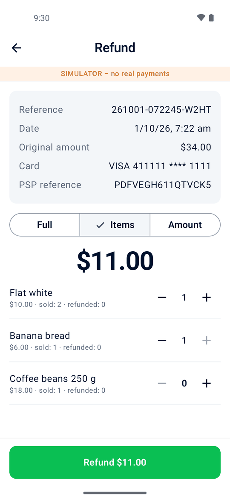 | 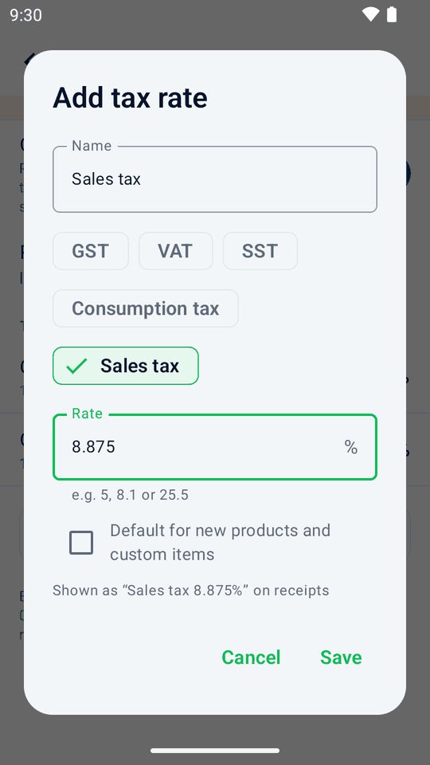 |
| New sale | Waiting for the card | Refund by item | Tax rates |
| 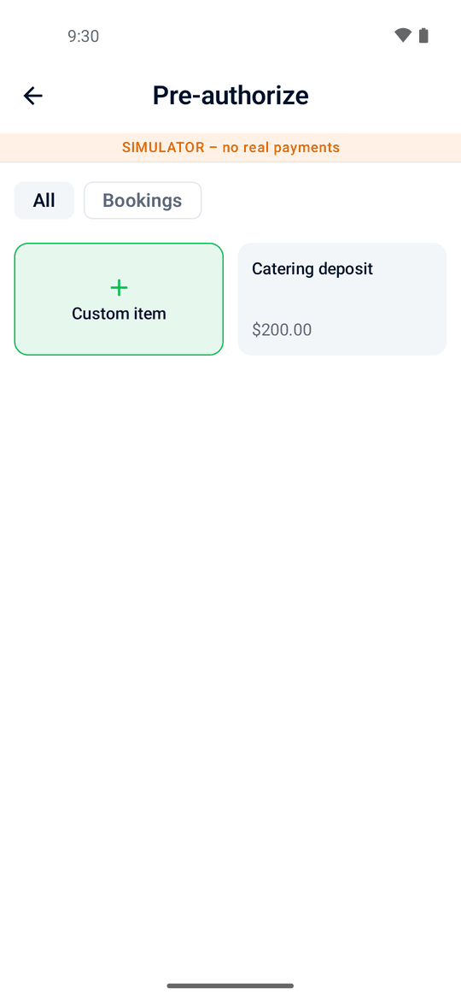 | 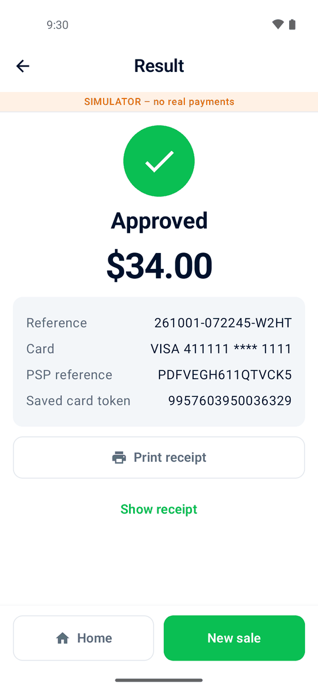 | 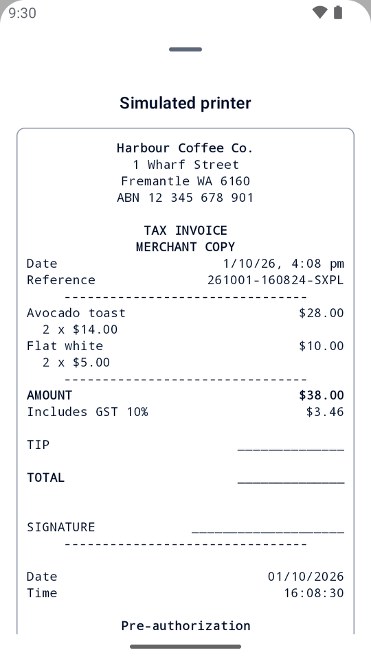 | 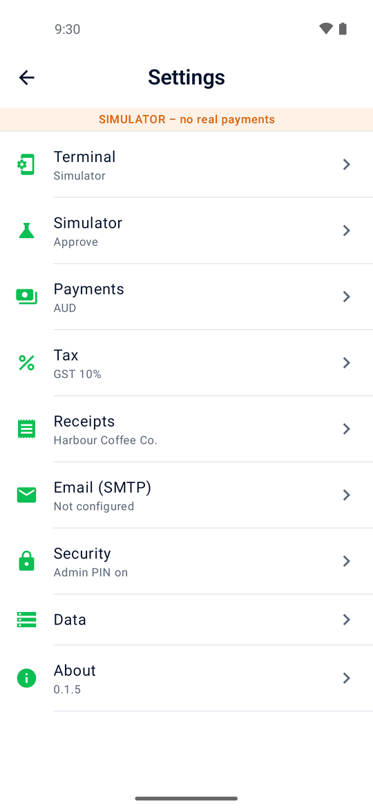 |
| Pre-authorize | Approved | Receipt with tip lines | Settings |
| 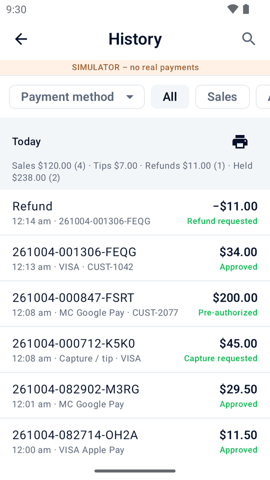 | 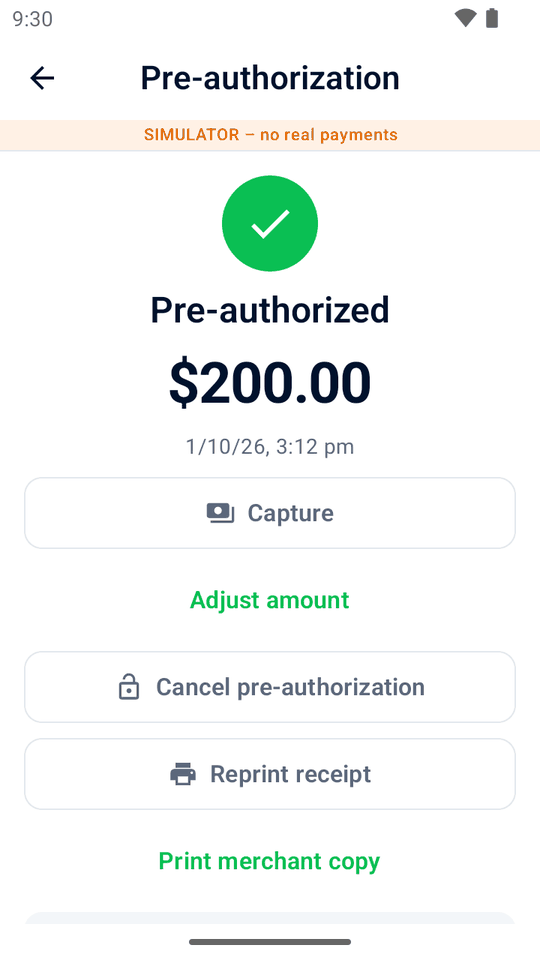 | 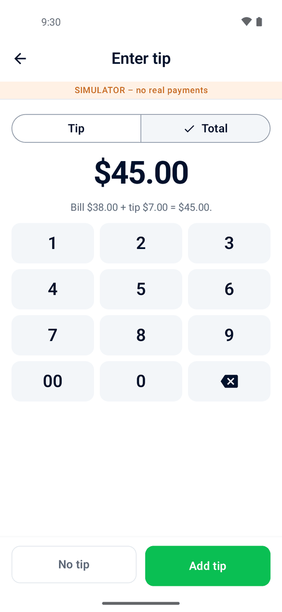 | 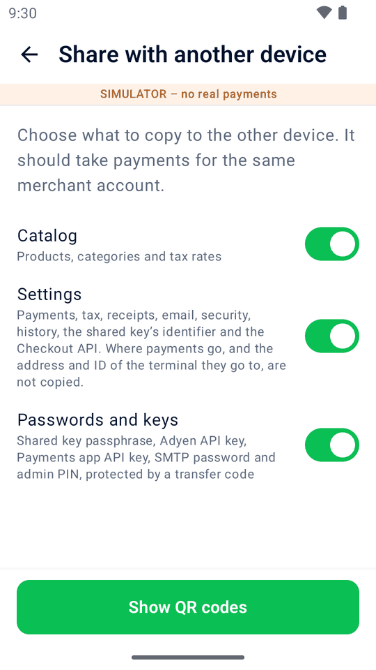 |
| History | Pre-authorization in history | Enter tip | Choose what to share |
| 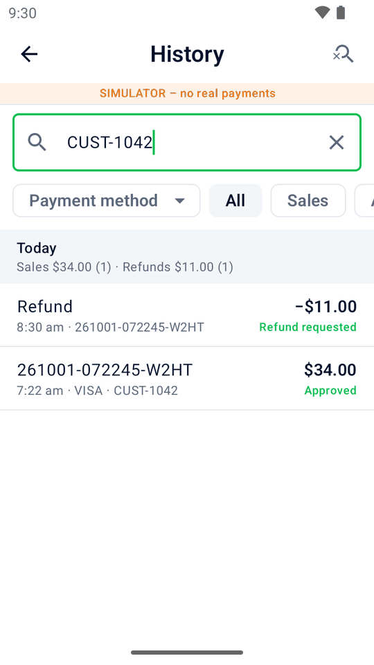 | | | 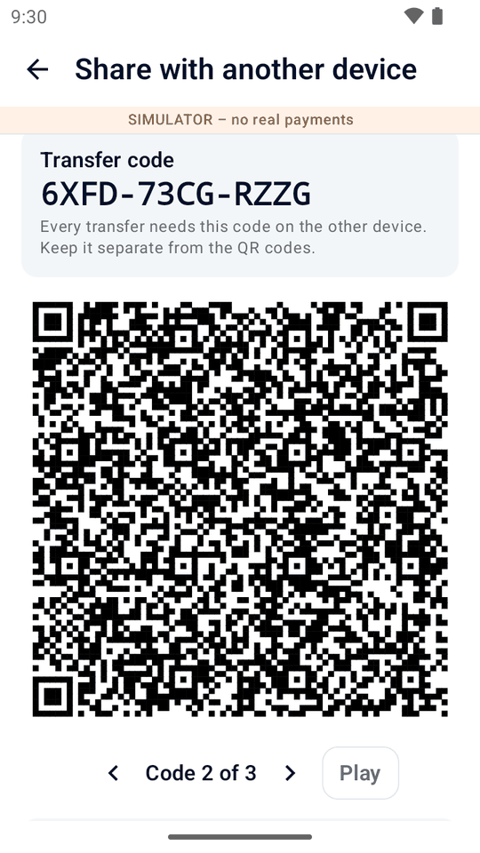 |
| Searching history | | | Share with another device |

Screenshots show an English demo café running on the built-in simulator (hence the "SIMULATOR" banner).

## Requirements

- An Adyen account with Terminal API enabled, and Android payment terminals running **Android 9 or later**, for example
  S1F2, S1F4Pro, S1E4Pro, S1E2L, AMS1, S1U2 or SFO1. The older S1E runs Android 7.1 and is not supported. Printing
  needs a terminal with a printer; scanning receipts, barcodes and setup codes needs a camera.
- Or an Android tablet or phone (Android 9 or later) to use a terminal on your network or in the cloud. For Tap to Pay,
  a Google-certified phone with NFC and Android 12 or later, the Adyen Payments app, and Tap to Pay on Android enabled
  by Adyen Support (see Adyen's [requirements](https://docs.adyen.com/point-of-sale/mobile-android/requirements) and the
  [countries and payment methods](https://docs.adyen.com/point-of-sale/ipp-mobile) it supports).
- An API credential for Adyen's Checkout API (captures, adjustments and payment links), and optionally an SMTP mail
  server (emailed receipts).
- To build it yourself: JDK 17 or later (the build downloads JDK 21 for itself) and the Android SDK with platform 37.

## Try it

Install `minimpos-<version>.apk` from the [latest release](https://github.com/astiskala/minimpos/releases/latest) on
any Android phone or emulator. Away from an Adyen terminal it takes payments with its built-in simulator, which
approves, declines, times out or reports a busy terminal as you choose in Settings › Simulator.

Or build it from source:

```sh
git clone https://github.com/astiskala/minimpos.git
cd minimpos
./gradlew :app:installDebug
```

Or open the project in Android Studio and run the `app` configuration.

## Put it on your terminals

The [Getting started guide](https://astiskala.github.io/minimpos/getting-started.html) walks through all of this,
plus setting up your business, products, payment links, tips and pre-authorizations. In short:

1. **Create a shared key** in your Customer Area under **Devices › Device settings › Integrations › Terminal API ›
   Encryption key**, and note its identifier, passphrase and version.
2. **Get a signed APK.** The easiest way is to download `minimpos-<version>.apk` from the
   [latest release](https://github.com/astiskala/minimpos/releases/latest), which is signed by the maintainer.

   Or build and sign your own. Adyen accepts an unsigned upload, but the terminal then refuses it with
   `INSTALL_PARSE_FAILED_NO_CERTIFICATES`. Create a key once and keep it safe:

   ```sh
   keytool -genkeypair -keystore ~/.android/minimpos-release.jks -alias minimpos -keyalg RSA -keysize 4096 \
     -validity 10000 -dname "CN=Mini mPOS"
   ```

   Then add a `keystore.properties` file (never commit it) with `storeFile`, `storePassword`, `keyAlias` and
   `keyPassword`, raise `versionCode` in `version.properties` for every upload, and run
   `./gradlew :app:assembleRelease`. Upload `app/build/outputs/apk/release/app-release.apk`, not
   `app-release-unsigned.apk`.

   Stick to one of the two: once you have uploaded the app, the Customer Area only accepts later versions signed with
   the same key, and rejects others with `INVALID_SIGNING_CERTIFICATE_MISMATCH` until Adyen Support deletes the
   earlier versions.
3. **Upload and deploy** the APK in your Customer Area, as described in Adyen's
   [app deployment guide](https://docs.adyen.com/point-of-sale/android-terminals/deploy-apps). Adyen converts the app
   for the terminals and installs it on the ones you choose.
4. **Connect it:** paste the shared key and the Checkout API (step 6) into the
   [setup helper](https://astiskala.github.io/minimpos/setup.html) on a computer and scan its codes with Settings ›
   Data › **Set up from another device**. Or tap **Connect to this terminal** on Home (or go to Settings › Terminal),
   enter the key identifier and passphrase (and the version, if it isn't 1), then tap **Save and test** or the
   keyboard's Done key. The terminal's ID, address and TEST/LIVE environment are detected automatically, and the result
   names the currency if it follows the device's region.
5. **Set up your business:** Settings › Payments (currency, references, saved cards), Tax (check the starting rates),
   Receipts and optionally Email (SMTP). Then set an admin PIN under Security.
6. **Connect the Checkout API** (step 2 of Settings › Terminal; payments wait for it): create an API credential
   (Customer Area, Developers › API credentials) with only the **Checkout webservice role**, enter your merchant
   account and its API key, then tap **Save and test API key**. LIVE terminals also need your live URL prefix
   (Developers › API URLs), asked for once the terminal is known to be LIVE.
7. **More devices:** on the first one, open Settings › Data › **Share with another device**; on each new one,
   **Set up from another device**, scan the codes and type the transfer code shown.

The app meets Adyen's [app requirements](https://docs.adyen.com/point-of-sale/android-terminals/app-requirements): it
only asks for the internet, network state and camera permissions, and the build checks this on every run.

## Use it on a tablet or phone

Install the same APK (sideloaded from the [latest release](https://github.com/astiskala/minimpos/releases/latest)),
then choose under Settings › Terminal › **Payments go to**, and follow the numbered steps below it (or fill all of it
in on a computer with the [setup helper](https://astiskala.github.io/minimpos/setup.html)):

- **A terminal on your network**: the recommended setup for a tablet at the counter. Requests go straight to the
  terminal, encrypted with its shared key. Enter (1) the terminal's IP address and POIID, (2) the shared key and (3) the
  Checkout API. Mini mPOS does not need to be installed on the terminal.
- **A terminal over the internet (cloud)**: for a tablet and terminal on different networks. Create an API credential
  for this device with the **Cloud Device API** and **Checkout webservice** roles, enter (1) the merchant account and
  API key under **Adyen account**, then (2) tap **Find connected terminals** and choose one (or type its POIID), and
  **Test connection**, which tests the terminal and the Checkout API. Payment requests wait at least 160 seconds, as
  Adyen requires for cloud payments.
- **Tap to Pay on this phone**: shoppers tap on the phone, in the Adyen Payments app (no card reader). (1) Install
  **Adyen Payments Test** (TEST) or **Adyen Payments** (LIVE) from Google Play (the app links to both), (2) enter the
  Checkout API, (3) under **Tap to Pay** the **Payments app API key** (a credential with only the Adyen Payments app
  role, which Adyen Support enables) and optionally a store ID, and tap **Set up Tap to Pay**, then (4) enter the
  shared key, which encrypts the payments, as Adyen's
  [Payments app guide](https://docs.adyen.com/point-of-sale/mobile-android/build/payments-app) requires. The
  environment follows the Payments app installed.

Off a terminal, results and history also offer **Share receipt**, which sends the receipt as an image through Android's
share sheet.

> [!WARNING]
> Mini mPOS stores Adyen API keys on the device (encrypted with the Android Keystore): the Adyen API key wherever
> payments go, and with Tap to Pay also the Payments app API key. Adyen advises keeping API keys on a server; Mini mPOS
> has none. Use a credential for that device only, with only the roles it needs, set an admin PIN, and revoke the key
> in the Customer Area if the device is lost.

## Language and receipts

The app supports English, Simplified Chinese and Japanese. On Android 12 or earlier it follows the device language;
on Android 13 or later, choose a language in the system's app-language settings. New installations use localized
receipt defaults and sample labels. Existing receipt titles, footers, tax names, email subjects and transferred
catalogs stay as written: review them in Settings › Receipts, Tax and Email (SMTP), and in Products.

Adyen-generated payment receipt data stays verbatim and follows the terminal's own receipt-language setting.
Plain-text receipts account for wide Chinese and Japanese characters, and Japanese receipts show taxable amounts
by rate (税込 / 税抜). This does **not** make them official Chinese 发票 or guarantee Japanese qualified-invoice
compliance; reduced-rate item marking, rounding and registration requirements need separate verification. See the
[language and receipt guidance](https://astiskala.github.io/minimpos/getting-started.html#language-receipts) for details
and official reference links.

## Good to know

- Refunds, captures and asynchronous adjustments are confirmed by Adyen later, so the app shows them as "Refund
  requested" or "Capture requested"; the final outcome is in your Customer Area. Mini mPOS has no backend to receive
  webhooks.
- Refunds are always referenced to the original payment. Unreferenced refunds are not supported.
- Pre-authorizations and sales with a tip on the receipt are sent with `authorisationType=PreAuth` and
  `manualCapture=true`, so only they wait for a capture; ask Adyen Support to enable pre-authorization for your payment
  methods first. Wallets and debit cards may not support it.
- Tips up to 20% of the bill are captured on top of what was authorized (overcapture), which Adyen Support has to
  enable for your account; larger tips raise the authorization first. If the issuer refuses, the tip is not saved and a
  smaller one (or none) can be entered. Once entered, a tip cannot be changed.
- A capture whose result is unknown can be sent again from history without capturing twice (it reuses its idempotency
  key). Synchronous adjustments need **Return adjust authorisation data** (Customer Area, Devices › Developer ›
  Additional data); without it, adjustments are asynchronous.
- Holds expire, so capture tips and pre-authorizations promptly. Canceling one from history
  is a full reversal: Adyen refunds it in full if it was already captured.
- Payment links: without a server for webhooks, the app learns that a link was paid only by asking Adyen (every few
  seconds while the link is shown, or with **Check payment**), and Adyen's answer has no PSP reference. So a sale paid
  through a link counts in the day's totals but is refunded in the Customer Area (Payments › Payment list), not from
  the app. An unpaid link counts nowhere; it shows "Awaiting payment" in history until it is paid, expires or is
  canceled. Links work for 24 hours by default (up to 70 days), and are for sales only. They are not simulated: they
  need the Checkout API, with payments going to a terminal, the cloud or Tap to Pay. Your account's risk and capture
  settings apply to them, as to any online payment.
- History's wallet (Apple Pay, Google Pay, Samsung Pay) comes from the `paymentMethodVariant` the terminal returns,
  such as `visa_applepay`. Search and filters only cover transactions still on the device (Settings › Data › Keep
  transactions for).
- With Tap to Pay there is no printer (receipts are emailed or shared, so tips on the receipt are not offered), and the
  Payments app takes only payments and referenced refunds. It cannot be asked for a transaction's status, so a payment
  whose answer goes missing (for example when you come back from the Payments app without a result) stays "unknown":
  check it in the Customer Area. An answer that arrives after Mini mPOS was restarted is used by **Check result
  again**.
- In the cloud, a payment fails straight away when Adyen reports the terminal as not connected; when Adyen got no
  answer from it, the payment is settled with status checks, as on the network.
- Settings from another device replace this device's, except where payments go, the address and ID of its terminal,
  its Tap to Pay installation, the detected TEST/LIVE environment and data center, and the simulator. The shared key
  passphrase only works if the Customer Area gives both terminals the same shared key (for example at store or merchant
  account level). The receiving device needs a camera.
- The setup helper's codes set only what was filled in (where payments go, the terminal's address and ID, the shared
  key, the Checkout API, Tap to Pay); the device's other settings stay as they are. On a terminal, payments always stay
  on the terminal itself.
- Only the latest [release](https://github.com/astiskala/minimpos/releases) is maintained.

## How it works

Mini mPOS runs on the payment terminal and sends Terminal API requests to the terminal's own payment app at
`https://localhost:8443/nexo`, using Adyen's official
[Java API library](https://github.com/Adyen/adyen-java-api-library) (`TerminalLocalAPI`). Requests are encrypted with
your shared key, and the terminal's certificate is checked against Adyen's terminal root certificates bundled with the
app; the root it chains to tells the app whether the terminal is a TEST or LIVE one. Each payment and refund
identifies itself to Adyen as "Mini mPOS" (application info). The terminal's own receipt printing is suppressed, so the
app prints one combined slip with Adyen's card receipt lines in it.

Off-terminal, the same requests go to a terminal on the network (with the shared key, at
`https://<address>:8443/nexo`), to Adyen's [Cloud device API](https://docs.adyen.com/point-of-sale/design-your-integration/choose-your-architecture/cloud)
(`/v1/merchants/{merchantAccount}/devices/{POIID}/sync`, authenticated with an API key; the TEST or LIVE endpoint and
data center are found by trying the key), or to the
[Adyen Payments app](https://docs.adyen.com/point-of-sale/mobile-android/build/payments-app) on the same phone, as App
Links encrypted with the shared key. The Payments app is boarded with Adyen's Management API, using an API key with the
Adyen Payments app role.

Every payment is stored as pending before it is sent, so one interrupted by a crash or restart shows up as "Result
unknown" in history instead of disappearing. Without an answer by the payment timeout (120 seconds by default), the
app asks the terminal for the transaction's status every few seconds until it is settled.

The app has no backend: products, settings and sales history stay on the device. Card details never reach the app;
it only sees what Adyen returns, such as the brand, masked card number, PSP reference and (when tokenizing) the stored
payment method ID. With its Adyen API key it also calls Adyen's
[Checkout API](https://docs.adyen.com/api-explorer/Checkout/latest/overview) (`/payments/{pspReference}/captures` and
`/amountUpdates`) to capture tips and pre-authorizations, and `/paymentLinks` to create, check and expire payment
links; the key is stored encrypted with the Android Keystore.

The code is split into three modules, plus `website-test`, which checks the website in `docs/`:

| Module | Contents |
| --- | --- |
| `core` | Plain Kotlin: money and tax math, cart, refunds, receipt layout, catalog and refund QR codes, Adyen's currency table. |
| `adyen` | Adyen integration: Terminal, Checkout, Cloud device and Management APIs; local and Payments app transports; retry advice and the simulator. |
| `app` | The Android app: Jetpack Compose (Material 3), Navigation 3, Room, DataStore, CameraX and ZXing, JavaMail. |

## Contributing and security

Contributions are welcome: see [CONTRIBUTING.md](CONTRIBUTING.md) for how to build, test and propose changes. Please
report security issues privately as described in [SECURITY.md](SECURITY.md).

## License

[MIT](LICENSE) © 2026 Adam Stiskala.

Adyen is a trademark of Adyen N.V. Mini mPOS is not affiliated with, endorsed by or supported by Adyen.
